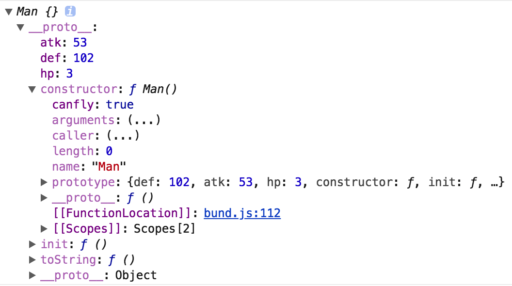

# 装饰者模式

## 装饰者模式的特点

可以动态的给某个对象添加额外的职责，而不会影响从这个类中派生的其它对象

## 继承的一些缺点

1.继承会导致超类和子类之间存在强耦合性，当超类改变时，子类也会随之改变；

2.超类的内部细节对于子类是可见的，继承常常被认为破坏了封装性；

## JavaScript中的装饰者模式

> 装饰者模式相当于使用一个新对象包住旧对象，旧对象的属性会在新对象的原型上（纯粹的装饰模式），类上的装饰属性会在旧对象的构造函数中。每一个对象都有机会处理这个装饰者。

***
首先新建一个类，防御为2，攻击为3，hp为3

    // def防御，atk攻击
    class Man {
      constructor(def = 2, atk = 3, hp = 3) {
        this.init(def, atk, hp)
      }
      init(def, atk, hp) {
        this.def = def,
        this.atk = atk,
        this.hp = hp
      }
      toString(){
        return `防御力:${this.def},攻击力:${this.atk},血量:${this.hp}`;
      }
    }
    const tony = new Man()
    console.log(`${tony}`)


输出： 防御力:2,攻击力:3,血量:3

***
给Man类加上decorateArmour装饰器

其中： 

target：Man类的原型

key：所装饰的函数名

descriptor：所装饰的属性详情

    // 纯粹的装饰模式 ，防御增加100
    function decorateArmour (target, key, descriptor) {
      // method为init函数
      const method = descriptor.value
      let moreDef = 100
      let ret
      // 重新执行init函数 
      descriptor.value = (...args)=>{
        args[0] += moreDef;
        ret = method.apply(target, args)
        return ret
      }
      // 返回一个新的函数
      return descriptor
    }
    class Man {
      constructor(def = 2, atk = 3, hp = 3) {
        this.init(def, atk, hp)
      }
      
      @decorateArmour
      init(def, atk, hp) {
        this.def = def,
        this.atk = atk,
        this.hp = hp
      }
      toString(){
        return `防御力:${this.def},攻击力:${this.atk},血量:${this.hp}`;
      }
    }

      descriptor.value = (...args)=>{
        args[0] += moreDef;
        ret = method.apply(target, args)
        return ret
      }

这段函数中，相当于对init属性进行了一层封装，先对原参数进行操作，得到新参数，然后返回使用新参数执行的init函数，this指向Man的原型。

最后，装饰器返回所装饰的属性（init）

输出：防御力:102,攻击力:3,血量:3

***

在类上加装饰器，半透明的装饰模式, 作用在类上

返回：返回一个函数

参数：target： 类本身

    function skill (skill) {
      if (typeof skill !== 'object') {
        throw Error('skill must be a object')
      }
      if (!skill.option) {
        throw Error('option in skill cant be undefine')
      }
      if (!skill.skill) {
        throw Error('skill in skill cant be undefine')
      }
      return function(target) {
        if (skill.option === 'add') {
          target[`can${skill.skill}`] = true
        }
        let method = target.prototype.toString
        let extry = `(增加技能: ${skill.skill})`
        // 重新定义toSting函数
        target.prototype.toString = (...args) => {
          return method.apply(target.prototype, args) + extry
        }
        // 返回一个新的类
        return target
      }
    }
    @skill({
      option: 'add',
      skill: 'fly'
    })
    class Man {
      constructor(def = 2, atk = 3, hp = 3) {
        this.init(def, atk, hp)
      }
      
      @decorateArmour
      init(def, atk, hp) {
        this.def = def,
        this.atk = atk,
        this.hp = hp
      }
      toString(){
        return `防御力:${this.def},攻击力:${this.atk},血量:${this.hp}`;
      }
    }

主要看如下代码

      // 对类增加新属性，会加到constructor中（构造函数中）
      target[`can${skill.skill}`] = true
      let method = target.prototype.toString
      let extry = `(增加技能: ${skill.skill})`
      // 重新定义toSting函数
      target.prototype.toString = (...args) => {
        return method.apply(target.prototype, args) + extry
      }
      // 返回一个新的类
      return target

这段代码，重新封装了类，重新定义了所要改变的函数，增加了新的属性。重新定义了toString的返回。
最后，返回类本身。

输出： 防御力:102,攻击力:3,血量:3(增加技能: fly)

最后的Man类

</img>


***

***

## 使用原生JavaScript实现装饰模式

```
function Man() {
  this.init(def = 2, atk = 3, hp = 3)
}
Man.prototype.init = function(def, atk, hp) {
  this.def = def
  this.atk = atk
  this.hp = hp
}
Man.prototype.toString = function() {
  return `防御力:${this.def},攻击力:${this.atk},血量:${this.hp}`;
}

// 装饰器对象
function Decorete(man) {
  this.man = man
} 

// 重新定义父类方法
Decorete.prototype.toString = function() {
  return this.man.toString()
}

// 创建具体的装饰器，集成装饰器对象
function decoratorIcroMan(man) {

  // 对传入的对象进行处理
  const moreDef = 100
  man.def += moreDef
  Decorete.call(this, man)
}

decoratorIcroMan.prototype = Object.create(Decorete.prototype)

decoratorIcroMan.prototype.toString = function() {
  return this.man.toString()
}

let tony = new Man()

tony = new decoratorIcroMan(tony)


console.log(`${tony}`)
console.log(tony)

```

输出=> 防御力:102,攻击力:3,血量:3